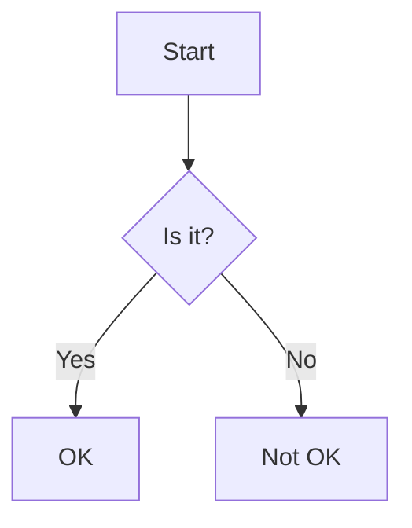

# How to Create a Post (and Feature Guide)

Welcome, author\! This document explains the two-step process for creating a new blog post.

## Part 1: Create Your Post File

Every post is a single JavaScript file that exports an object.

1.  **Create a File:** Go to the `/src/blog/posts/` directory.
2.  **Name Your File:** Create a new file with a unique, URL-friendly name (e.g., `my-first-awesome-post.js`).
3.  **Copy the Template:** Copy the code below into your new file.

<!-- end list -->

```js
export default {
  // --- Metadata ---
  
  // A unique, URL-friendly ID.
  id: 'my-first-awesome-post', 
  
  // The main title of the post.
  title: 'My First Awesome Post',
  
  // A short description for SEO and link previews.
  description: 'A short, compelling summary of what this post is about.',
  
  // The publication date in YYYY-MM-DD format.
  date: '2025-11-10',
  
  // The author's name.
  author: 'Tarik',
  
  // An array of categories.
  categories: ['React', 'Tutorials'],
  
  // (Optional) Path to a thumbnail image (e.g., '/images/posts/my-post/thumb.png').
  thumbnail: null,
  
  // (Optional) Set to 'true' to feature this post on the homepage.
  featured: false, 
  
  // (Optional) An array of keywords for SEO.
  keywords: ['react', 'hooks', 'tutorial'],
  
  // --- Post Content ---
  
  // This is where you write your Markdown!
  // Start writing on the line right after the backtick.
  // DO NOT indent your Markdown.
  content: `
# This is my Title

This is the first paragraph of my new post.
`
};
```

-----

## Part 2: Use the Feature Guide (Live Demo)

Now that you have your file, you can start writing. Use this section as a live reference for all the powerful components you can embed directly into your Markdown.

### 1\. Content Structure & Callouts

#### GitHub-Style Callouts (Preferred)

Use the standard blockquote syntax with a special tag.

**Syntax:**

```markdown
> [!INFO]
> This is an information block. Perfect for supplemental details.

> [!WARNING]
> This is a warning block. Use this for important, non-critical advice.

> [!ALERT]
> This is an alert block. Use this for critical information or dangers.
```

**Live Demo:**

> [\!INFO]
> This is an information block. Perfect for supplemental details.

> [\!WARNING]
> This is a warning block. Use this for important, non-critical advice.

> [\!ALERT]
> This is an alert block. Use this for critical information or dangers.

#### Spoilers / Accordions

Use standard HTML `<details>` and `<summary>` tags. They are automatically styled.

**Syntax:**

```html
<details>
  <summary>Click me to reveal the details</summary>

  This content is hidden until you click. You can include **Markdown** inside.
</details>
```

**Live Demo:**

\<details\>
\<summary\>Click me to reveal the details\</summary\>

This content is hidden until you click. You can include **Markdown** inside.

\</details\>

-----

### 2\. Code & Interactivity

#### Standard Code Blocks

Standard fences are rendered with syntax highlighting and a copy button.

**Syntax:**

```js
// A standard JavaScript code block
function helloWorld() {
  console.log("Hello, World!");
}
```

#### Code Tabs

Use the `<Tabs>` and `<Tab>` components to group code blocks.

**Syntax:**

````markdown
<Tabs>
  <Tab title="JavaScript">
    ```js
    console.log("Hello from JS!");
    ```
  </Tab>
  <Tab title="Python">
    ```py
    print("Hello from Python!")
    ```
  </Tab>
</Tabs>
````

**Live Demo:**

\<Tabs\>
\<Tab title="JavaScript"\>
` js console.log(&quot;Hello from JS!&quot;);  `
\</Tab\>
\<Tab title="Python"\>
` py print(&quot;Hello from Python!&quot;)  `
\</Tab\>
\</Tabs\>

#### Live React Sandbox

Use `react-live` for editable, runnable React demos.

**Syntax:**

```react-live
function Counter() {
  const [count, setCount] = React.useState(0);
  return (
    <div style={{ padding: '1rem', border: '1px solid #555', borderRadius: '8px' }}>
      <p style={{ marginBottom: '1rem' }}>Count: {count}</p>
      <button 
        onClick={() => setCount(count + 1)}
        style={{ background: '#007bff', color: 'white', padding: '8px 12px', border: 'none', borderRadius: '4px', cursor: 'pointer' }}
      >
        Click me
      </button>
    </div>
  );
}
```

**Live Demo:**

```react-live
function Counter() {
  const [count, setCount] = React.useState(0);
  return (
    <div style={{ padding: '1rem', border: '1px solid #555', borderRadius: '8px' }}>
      <p style={{ marginBottom: '1rem' }}>Count: {count}</p>
      <button 
        onClick={() => setCount(count + 1)}
        style={{ background: '#007bff', color: 'white', padding: '8px 12px', border: 'none', borderRadius: '4px', cursor: 'pointer' }}
      >
        Click me
      </button>
    </div>
  );
}
```

-----

### 3\. Data Visualization

#### Mermaid Diagrams

Render complex diagrams from text. Includes a Diagram/Code toggle.

**Syntax:**



**Live Demo:**


#### Interactive Charts (Chart.js)

Render charts from JSON. Supported types: `chart-bar`, `chart-line`, `chart-pie`, `chart-doughnut`.

**Syntax:**

```chart-line
{
  "title": "Blog Growth (Demo Data)",
  "labels": ["January", "February", "March", "April"],
  "datasets": [
    { "label": "Articles", "data": [5, 9, 15, 22], "borderColor": "rgb(75, 192, 192)" },
    { "label": "Users", "data": [120, 300, 750, 1500], "borderColor": "rgb(255, 99, 132)" }
  ]
}
```

**Live Demo:**

```chart-line
{
  "title": "Blog Growth (Demo Data)",
  "labels": ["January", "February", "March", "April"],
  "datasets": [
    { "label": "Articles", "data": [5, 9, 15, 22], "borderColor": "rgb(75, 192, 192)" },
    { "label": "Users", "data": [120, 300, 750, 1500], "borderColor": "rgb(255, 99, 132)" }
  ]
}
```

#### Interactive Tables (TanStack Table)

Render a sortable table from JSON. Click column headers to sort.

**Syntax:**

```table-data
[
  { "id": 1, "framework": "React", "license": "MIT" },
  { "id": 2, "framework": "Vue", "license": "MIT" },
  { "id": 3, "framework": "Svelte", "license": "MIT" }
]
```

**Live Demo:**

```table-data
[
  { "id": 1, "framework": "React", "license": "MIT" },
  { "id": 2, "framework": "Vue", "license": "MIT" },
  { "id": 3, "framework": "Svelte", "license": "MIT" }
]
```

-----

### 4\. Academic & Media Embeds

#### LaTeX Math Formulas (KaTeX)

Render math formulas. Use `block` prop for centered, display-mode.

**Syntax:**

```markdown
The Pythagorean theorem, <Katex>a^2 + b^2 = c^2</Katex>, is fundamental.

<Katex block>
  \int_{-\infty}^{\infty} e^{-x^2} dx = \sqrt{\pi}
</Katex>
```

**Live Demo:**

The Pythagorean theorem, \<Katex\>a^2 + b^2 = c^2\</Katex\>, is fundamental.

\<Katex block\>
\\int\_{-\\infty}^{\\infty} e^{-x^2} dx = \\sqrt{\\pi}
\</Katex\>

#### Interactive Math (GeoGebra)

Embed interactive GeoGebra applets using the `materialId` from its URL.

**Syntax:**

```markdown
<GeoGebra materialId="v3a4b9c8" />
```

**Live Demo:**

\<GeoGebra materialId="v3a4b9c8" /\>

#### YouTube Videos

Embed responsive YouTube videos with just the `videoId`.

**Syntax:**

```markdown
<YouTube videoId="6vK1qKfgP8c" title="What is Bouldering?" />
```

**Live Demo:**

\<YouTube videoId="6vK1qKfgP8c" title="What is Bouldering?" /\>

-----

## Authoring Guidelines

### 1\. Be Semantic

Use the right tool for the job.

  * **Charts vs. Tables:** Don't use a chart for a 2x2 grid. Use `table-data` only when you need sortable columns. Standard Markdown tables are preferred for simple, non-sortable data.
  * **Callouts:** Use `> [!INFO]` to highlight information, not to style an entire section.
  * **KaTeX:** Use for mathematical notation, not for styling regular text.

### 2\. Prioritize Performance

**Embeds are expensive.** Every Chart, GeoGebra applet, `react-live` sandbox, and YouTube video adds significant load time.

  * **Limit Embeds:** Try to limit the number of *heavy* embeds (GeoGebra, `react-live`, YouTube) per page.
  * **Prefer Native:** KaTeX and Mermaid are generally faster than iframe-based embeds.

### 3\. Design for Accessibility (a11y)

  * **Provide Titles:** Always provide a descriptive `title` prop for `<YouTube>` and `<GeoGebra>` embeds for screen readers.
  * **Spoilers:** The `<summary>` text must clearly describe the content it hides.

### 4\. Ensure Data Integrity

All components that consume JSON (`chart-...`, `table-data`) will fail if the JSON is malformed.

  * **No Trailing Commas.**
  * **Use Double Quotes** for all JSON keys and string values.
  * **Test Locally:** Always preview your post before publishing.

### 5\. Syntax Nuances (When copying into `.js` file)

  * **Backslash Escaping:** Because this Markdown will be inside a JS template string, you **must** escape all backslashes (`\`).
      * **KaTeX:** `\frac` must be written as `\\frac`.
      * **KaTeX:** `\sqrt` must be written as `\\sqrt`.
  * **Component Tags:** React components (`<Tabs>`, `<Katex>`) are case-sensitive.

Happy authoring\!